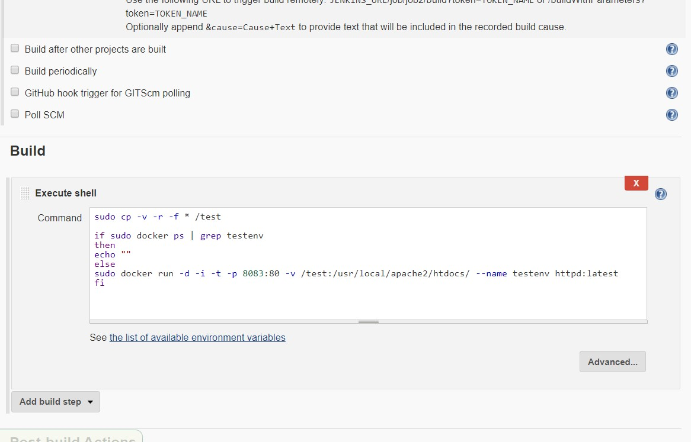

# jenkins_testing_production_env
>**Requirements**:
* docker

* git

* github account

* httpd docker image

* jenkins
  
>**How to use**:
* Clone github repository.
  
* Configure git hooks.

  * 
  
* Configure jenkins job1

  * 
    
  * 
  
* Configure jenkins job2

  * 
    
  * 
  
* Add file to master branch of local git repository.

  * 
  
* Add file to staging area and then move the files to commit area, as we configured git hook, when we commit, repo will directly pushed to the github master branch.

  * 
    
  * 
  
* Since our jenkin job1 is configured, it will automatically copy the file to production environment and start docker container for production purpose.

  * 
    
  * 
    
  * 
    
* Add file to dev1 branch of local git repository.

  * 
    
* Add file to staging area and then move file to commit area, as we configured git hook, when we commit, repo will directly pushed to the github dev1 branch.

  * 
    
  * 
    
* Since our jenkin job2 is configured, it will automatically copy the file to testing environment and start docker container for testing purpose.

  * 
    
  * 
    
  * 